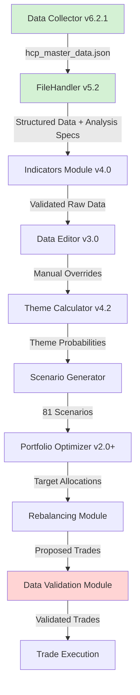

# HCP Portfolio Tracker - Data Flow v2
## IPS v4.4 Compliant Pipeline with Validation
### Last Updated: 2025-09-11T08:00:00Z



## Module Descriptions and Data Flow

### 1. **Data Collector v6.2.1** ✅ UPDATED
- **Output**: `hcp_master_data.json`
- **Contains**: 
  - Raw values for all 12 indicators
  - Transformed values for 5 indicators (DXY, TIC, Productivity, P/E, SPY/EFA)
  - Percentile ranks where applicable
  - Nested theme structure

### 2. **FileHandler v5.2** ✅ UPDATED
- **Input**: JSON with nested theme structure
- **Processing**:
  - Detects transformations and prioritizes them
  - Adds analysis method specifications
  - Calculates percentiles on correct data series
  - Identifies GARCH-suitable indicators (only 2-3)
- **Output**: 
  - `currentValue` (best for calculations)
  - `currentRaw` (always raw)
  - `currentTransformed` (when available)
  - `analysisMethod` specifications
  - `currentState` (-1, 0, 1)

### 3. **Indicators Module v4.0** ✅ (Already updated)
- **Input**: Structured data from FileHandler
- **Processing**: Validates and processes indicator states
- **Output**: Indicator states for themes

### 4. **Data Editor v3.0** ✅ (Already updated)
- **Purpose**: Manual override interface
- **Input**: Validated indicators
- **Output**: User adjustments to values

### 5. **Theme Calculator v4.2** 🟡 (Needs verification)
- **Input**: Indicator states and histories
- **Processing**:
  - GARCH only on 2-3 suitable indicators
  - Trend acceleration for COFER
  - Percentile-based for most others
- **Output**: Theme probabilities (4 themes)

### 6. **Scenario Generator**
- **Input**: Theme probabilities
- **Processing**: Creates 81 scenarios (3^4)
- **Output**: Scenario probabilities

### 7. **Portfolio Optimizer v2.0+** ✅ (No change needed)
- **Input**: 81 scenarios with probabilities
- **Processing**: Regret minimization
- **Output**: Target portfolio allocations

### 8. **Rebalancing Module**
- **Input**: Target allocations + current positions
- **Processing**: Calculates required trades
- **Output**: Proposed trade list

### 9. **Data Validation Module** 🆕 NEW
- **Position**: Between Rebalancing and Execution
- **Purpose**: Final sanity check before real money moves
- **Validation Checks**:
  ```javascript
  {
    dataFreshness: {
      tic_foreign_demand: age < 90 days,
      cofer_usd: age < 120 days,
      all_others: age < 35 days
    },
    calculationAnomalies: {
      allProbabilitiesNear50: false,
      scenarioProbabilitiesSum: ≈ 1.0,
      themeStatesValid: all in [-1, 0, 1]
    },
    positionSizing: {
      noSinglePosition: > 40%,
      totalAllocations: = 100%,
      minimumCash: >= 1%
    },
    tradeReasonableness: {
      maxSingleTrade: < 20% of portfolio,
      totalTurnover: < 50% per quarter,
      roundLotSizes: true
    },
    portfolioDivergence: {
      expectedVsActual: < 5% drift,
      unrecognizedPositions: none
    }
  }
  ```
- **Actions on Failure**:
  - ⚠️ Warnings: Proceed with caution flag
  - 🛑 Errors: Block execution, require manual review
  - 📊 Report: Generate validation report for user

### 10. **Trade Execution**
- **Input**: Validated trades only
- **Processing**: Execute trades via broker
- **Output**: Confirmation and updated positions

## Key Improvements in v2

1. **Clear Value Differentiation**: Every indicator now clearly specifies raw vs transformed values
2. **Analysis Method Specs**: Each indicator declares its analytical approach
3. **GARCH Clarity**: Only 2-3 indicators suitable, explicitly marked
4. **Validation Gateway**: Catches issues before money moves
5. **Percentile Consistency**: Calculated on the same series used for states

## Module Update Status

| Module | Version | Status | Changes Needed |
|--------|---------|--------|----------------|
| Data Collector | v6.2.1 | ✅ Complete | None |
| FileHandler | v5.2 | ✅ Complete | None |
| TrackerCore | v1.3 | ✅ Complete | None |
| Indicators | v4.0 | ✅ Complete | None |
| Data Editor | v3.0 | ✅ Complete | None |
| Theme Calculator | v4.2 | 🟡 Verify | Ensure uses correct values |
| Scenario Generator | - | ✅ OK | None |
| Portfolio Optimizer | v2.0+ | ✅ OK | None |
| Rebalancing | - | 🟡 Update | Add validation hooks |
| **Validation** | NEW | 🔴 Create | New module needed |

## Data Validation Module Integration Options

### Option A: Standalone Module (Recommended)
- **Pros**: Clear separation of concerns, reusable, testable
- **Cons**: Additional module to maintain

### Option B: Part of Rebalancing Module
- **Pros**: Fewer modules, integrated workflow
- **Cons**: Makes rebalancing more complex, harder to test

### Recommendation: **Option A**
Create as standalone module that can be called by Rebalancing before sending trades to execution. This maintains clean architecture and allows validation logic to be reused elsewhere if needed.

## Critical Data Points to Track

1. **Transformation Coverage**: Which indicators use transformed vs raw
2. **Data Staleness**: Age of each indicator's latest data point
3. **Calculation Confidence**: Based on data quality and age
4. **State Stability**: How often states are changing
5. **Portfolio Drift**: Divergence from target allocations